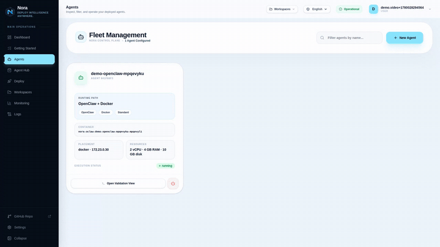

<div align="center">
  
  <h1>Nora</h1>
  <p><strong>Deploy &amp; operate AI agent fleets on infrastructure you control.</strong></p>
  <p>
    The self-hosted, runtime-neutral control plane for OpenClaw and Hermes agents — deploy, monitor, and operate them from one operator surface, Apache 2.0. Run on Docker or Kubernetes today, use NemoClaw sandboxes experimentally, and track Proxmox as a planned execution target.
  </p>
</div>

<p align="center">
  <a href="https://github.com/solomon2773/nora/releases"></a>
  <a href="https://github.com/solomon2773/nora/actions/workflows/ci-quality.yml"></a>
  <a href="https://www.npmjs.com/package/@noraai/cli"></a>
  <a href="https://www.npmjs.com/package/@noraai/mcp-server"></a>
  
  
</p>

<p align="center">
  <a href="https://noradocs.solomontsao.com">📚 Documentation</a> ·
  <a href="https://noradocs.solomontsao.com/quickstart">Quick Start</a> ·
  <a href="https://noradocs.solomontsao.com/self-hosting">Self-Hosting</a> ·
  <a href="https://noradocs.solomontsao.com/concepts/architecture">Architecture</a> ·
  <a href="https://noradocs.solomontsao.com/compare">How Nora Compares</a> ·
  <a href="CHANGELOG.md">Changelog</a> ·
  <a href="https://nora.solomontsao.com">Public Site</a> ·
  <a href="https://nora.solomontsao.com/signup">Create Account</a>
</p>

---

<p align="center">
  <a href="https://github.com/solomon2773/nora/raw/master/.github/readme-assets/walkthrough.mp4">
    
  </a>
</p>
<p align="center">
  <sub>▶ <b><a href="https://github.com/solomon2773/nora/raw/master/.github/readme-assets/walkthrough.mp4">Watch the walkthrough</a></b></sub>
</p>

## What Is Nora?

Nora is the self-hosted AI agent ops platform for running autonomous agent fleets on infrastructure you control — whether you standardize on OpenClaw, Hermes, or keep both available in the same operator surface.

Most teams running agents in production eventually rebuild the same layer around the runtime itself: deploy workflows, secrets, monitoring, logs, terminal, templates, and a separate admin surface. Nora exists so that layer doesn't have to be rewritten every time the runtime conversation changes. Operator workflows live under `/app`; platform-wide admin lives under `/admin`.

→ [Why Nora](https://noradocs.solomontsao.com/introduction#why-teams-choose-nora) · [Runtime model](https://noradocs.solomontsao.com/concepts/runtimes) · [Deployment footprint](https://noradocs.solomontsao.com/concepts/architecture#deployment-topologies)

## Features

- **Deploy & operate runtimes** — provision OpenClaw and Hermes agents to Docker or Kubernetes (both GA, official Helm chart) with full lifecycle controls: deploy, start/stop, restart, redeploy, and version history.
- **Migrate existing runtimes** — adopt agents you already run via uploaded bundles or live Docker/SSH inspection.
- **Live operator access** — streaming logs, an interactive terminal into running containers, a file browser/editor, and the OpenClaw gateway &amp; Hermes dashboard embedded in the operator UI.
- **Monitoring & alerting** — per-agent metrics and cost, a fleet needs-attention roll-up (errored, stuck, over-budget, stalled telemetry), and user-defined alert rules delivered to your channels.
- **Budgets & scheduled runs** — per-agent LLM budget hard caps with auto-pause, plus recurring cron schedules for agent runs with queue retries and sweep guards.
- **Secrets that fail closed** — provider keys AES-256-GCM encrypted at rest and synced to running runtimes; production refuses to boot without a valid encryption key; SSH host-key pinning protects remote (BYOC) Docker hosts.
- **Network isolation** — baseline Kubernetes NetworkPolicy ingress isolation with admin-managed CIDR allow rules, and an experimental NemoClaw hardened sandbox for untrusted code.
- **Agent Hub** — installable, versioned starter templates to go from zero to a working agent fast.
- **Integrations** — 69 integration providers (source control, chat, cloud, observability, vector DBs, automation) and 17+ LLM providers; expose connected integrations to agents as per-agent MCP servers.
- **Automate everything** — a public REST API (OpenAPI 3.1), the `@noraai/cli`, and the `@noraai/mcp-server` for Claude Code, Claude Desktop, and Cursor.
- **Workspaces & RBAC** — multi-tenant workspaces with ranked roles, a platform admin surface, account event history, and encrypted managed backups.

## Screenshots

<table>
  <tr>
    <td align="center" width="50%">
      <br />
      <sub><b>Operator dashboard</b></sub>
    </td>
    <td align="center" width="50%">
      <br />
      <sub><b>Fleet monitoring &amp; needs-attention triage</b></sub>
    </td>
  </tr>
  <tr>
    <td align="center" width="50%">
      <br />
      <sub><b>Agent deploy flow</b></sub>
    </td>
    <td align="center" width="50%">
      <br />
      <sub><b>Embedded OpenClaw gateway UI</b></sub>
    </td>
  </tr>
</table>

## Quick Start

> **Requirements:** macOS 12+, Linux, or Windows 10+ (WSL2), with Docker Engine + Compose v2. The installer checks for Docker, Git, and OpenSSL and installs anything missing.

**macOS / Linux / WSL2:**

```bash
curl -fsSL https://raw.githubusercontent.com/solomon2773/nora/master/setup.sh | bash
```

**Windows (PowerShell):**

```powershell
iwr -useb https://raw.githubusercontent.com/solomon2773/nora/master/setup.ps1 | iex
```

> **Windows requires [PowerShell 7+](https://learn.microsoft.com/powershell/scripting/install/installing-powershell-on-windows).** The default Windows PowerShell 5.1 is not supported — run the command above from a `pwsh` 7 session.

The installer verifies prerequisites, generates or preserves secrets, optionally creates a bootstrap admin, picks free local ports when the defaults are busy, and starts the stack. Once it finishes, open the URL printed by setup. Local mode defaults to `http://localhost:8080`, but setup may select another port such as `8081` on a busy workstation. Then follow the [first-15-minutes walkthrough](https://noradocs.solomontsao.com/quickstart).

For manual setup, environment variables, public-domain mode, TLS, Kubernetes, NemoClaw, and planned Proxmox configuration, see the docs:

- [Self-hosting guide](https://noradocs.solomontsao.com/self-hosting)
- [Environment variables reference](https://noradocs.solomontsao.com/configuration/environment-variables)
- [Provisioner backends](https://noradocs.solomontsao.com/configuration/provisioner-backends) (Docker and k3s/Kubernetes are GA; NemoClaw is experimental; Proxmox is planned)
- [TLS and public domains](https://noradocs.solomontsao.com/configuration/tls-domains)
- [Fronting a launch with Cloudflare](infra/cloudflare-launch.md) — edge caching, rate limiting, and spike absorption for the single-host deploy

## Documentation

Full docs live at **[noradocs.solomontsao.com](https://noradocs.solomontsao.com)**. The MDX source is in [`docs/`](./docs).

| Section                                                                        | What's there                                                                                           |
| ------------------------------------------------------------------------------ | ------------------------------------------------------------------------------------------------------ |
| [Quick Start](https://noradocs.solomontsao.com/quickstart)                     | Install and validate your first agent in 15 minutes                                                    |
| [Concepts](https://noradocs.solomontsao.com/concepts/architecture)             | Architecture, agents, runtimes, workspaces, LLM providers, Agent Hub                                   |
| [Configuration](https://noradocs.solomontsao.com/configuration/platform-modes) | Platform modes, env vars, provisioner backends, TLS / public domains                                   |
| [Guides](https://noradocs.solomontsao.com/guides/deploy-agent)                 | Deploy agent, providers, integrations, channels, monitoring, alert rules, backups, Agent Hub, NemoClaw |
| [API Reference](https://noradocs.solomontsao.com/api/overview)                 | Auth, workspaces, agents, channels, integrations, providers, monitoring, alert rules                   |
| [Support](https://noradocs.solomontsao.com/support/faq)                        | FAQ, troubleshooting                                                                                   |

## Architecture

```text
Nginx
├── /           → frontend-marketing  (Next.js)
├── /app/*      → frontend-dashboard  (Next.js)
├── /admin/*    → admin-dashboard     (Next.js)
└── /api/*      → backend-api         (Express.js)
                       ├── PostgreSQL
                       ├── Redis + BullMQ  (deployments, clawhub-jobs, backups, alert-deliveries)
                       ├── worker-provisioner
                       ├── worker-backup
                       └── runtime adapters/profiles  (Docker GA · k3s/k8s GA · NemoClaw experimental · Proxmox planned)
```

Full architecture write-up — system map, queue/worker boundaries, RBAC, migration contract, deployment topologies — is in [docs/concepts/architecture](https://noradocs.solomontsao.com/concepts/architecture).

## Tech Stack

| Layer                 | Technology                                                                         |
| --------------------- | ---------------------------------------------------------------------------------- |
| Reverse proxy         | Nginx                                                                              |
| Frontends             | Next.js 16, React 19, Tailwind CSS                                                 |
| Backend API           | Express.js 5, Node.js 24 LTS                                                       |
| Auth                  | JWT, HttpOnly cookies, bcryptjs, provider OAuth bridge                             |
| Database              | PostgreSQL 15                                                                      |
| Queue                 | BullMQ + Redis 7                                                                   |
| Runtime families      | OpenClaw, Hermes                                                                   |
| Provisioning backends | Docker and k3s/Kubernetes (GA); NemoClaw (experimental sandbox); Proxmox (planned) |
| Secrets at rest       | AES-256-GCM (provider keys, integrations, backups)                                 |

## Public REST API, CLI, and MCP

Workspace-scoped API keys (bearer-only, prefixed `nora_`, HMAC-hashed at rest, scope-based) drive a stable subset of the REST surface. Issue keys at `/app/workspaces/<id>/api-keys`.

```bash
export NORA_TOKEN="nora_..."
curl -H "Authorization: Bearer $NORA_TOKEN" https://your-nora.example.com/api/agents
```

A small CLI lives in [`cli/`](./cli) (`@noraai/cli`): run `nora login` once to save your host and API token, then `nora workspaces`, `nora agents`, and `nora monitoring` wrap the same REST surface. `nora doctor` runs an admin-only control-plane health check, and `nora mcp` launches the MCP stdio server. See the [API reference](https://noradocs.solomontsao.com/api/overview) for the supported endpoints and scopes.

**Operate Nora from Claude Code, Claude Desktop, or Cursor:** the [`mcp-server/`](./mcp-server) package (`@noraai/mcp-server`) exposes the same API as [Model Context Protocol](https://modelcontextprotocol.io) tools — deploy agents, control their lifecycle, and read fleet metrics, events, and per-agent cost from any MCP client. Destructive deletion stays disabled unless explicitly opted in.

```bash
claude mcp add nora \
  --env NORA_API_URL=https://your-nora.example.com \
  --env NORA_API_KEY=nora_... \
  -- npx -y @noraai/mcp-server
```

See the [MCP guide](https://noradocs.solomontsao.com/guides/mcp-server) for Claude Desktop/Cursor config, the tool list, and security notes.

## Standards & isolation

- **MCP — shipped.** A control-plane [MCP](https://modelcontextprotocol.io) server (`@noraai/mcp-server`, published to the official [MCP Registry](https://github.com/modelcontextprotocol/registry)) plus per-agent MCP server management — operate the fleet from Claude Code / Desktop / Cursor, and wire MCP tools into individual agents.
- **OpenTelemetry GenAI — available.** [OTLP + Prometheus export](https://noradocs.solomontsao.com/guides/opentelemetry) of runtime telemetry under the `gen_ai.*` semantic conventions — per-exchange chat spans plus token/cost/resource metrics flow into the Grafana / Datadog / Langfuse stack you already run. (Per-tool-call sub-spans depend on runtime event streams and remain on the roadmap.)
- **A2A — on the roadmap.** Agent Cards / Agent-to-Agent discovery for managed OpenClaw and Hermes agents.
- **Isolation, per deploy target.** Standard Docker and Kubernetes runs use container namespaces plus operator-set CPU / RAM / disk limits; the experimental **NemoClaw** profile hardens untrusted code with a non-root user, all Linux capabilities dropped, `no-new-privileges`, Landlock + seccomp, and default-deny egress; Proxmox VM placement (planned) is the future hardware-isolation tier. See the [isolation model](https://noradocs.solomontsao.com/concepts/security#runtime-isolation).

## Roadmap

- **NemoClaw hardening** _(high priority)_ — mature the experimental secure-sandbox profile end to end: enablement, policy controls, approvals, telemetry, and validation.
- **Proxmox execution target** — complete the planned LXC deployment path with lifecycle operations, log streaming, telemetry, and smoke coverage.
- **Hermes/OpenClaw parity** — close runtime gaps across validation, logs, terminal access, monitoring, and failure reporting.
- **First-run operator UX** — a tighter path from install to the first deployed, validated agent.
- **Account-scoped monitoring** — account-level health roll-ups across workspaces, agents, cost, and alerts, with drill-downs.
- **Auth & key-sync hardening** — key rotation, audit trails, and recovery from partial sync failures.
- **Agent Hub ergonomics** — better template discovery, install/configure flows, and post-install validation.
- **A2A support** — Agent Cards / agent-to-agent discovery for managed runtimes.

## Development

```bash
# Docker (recommended)
docker compose up -d
docker compose logs -f backend-api

# Tests
cd backend-api && npx jest --no-watchman
cd e2e && npm test
```

Start with [`CONTRIBUTING.md`](./CONTRIBUTING.md) for contributor guidance. [`CLAUDE.md`](./CLAUDE.md) documents the repo layout, development commands, and subtree ownership for humans and AI coding agents alike.

## Contributing

New here? Browse [**good first issues**](https://github.com/solomon2773/nora/labels/good%20first%20issue) for small, self-contained starting points, then skim [CONTRIBUTING.md](./CONTRIBUTING.md).

Strong contribution areas: runtime adapter work · operator and admin UX · provisioning and lifecycle orchestration · integrations and channels · test and CI hardening · self-hosted deployment ergonomics.

Typical workflow: fork → branch (`feature/...`) → commit → pull request.

## Community

- [Issues](https://github.com/solomon2773/nora/issues)
- [Discussions](https://github.com/solomon2773/nora/discussions)
- [Hermes Agent](https://github.com/NousResearch/Hermes-Agent)
- [OpenClaw](https://github.com/openclaw/openclaw)

If Nora is useful to you, a ⭐ on the repo helps other self-hosters find it.

## License

This project is open source under the [Apache License 2.0](./LICENSE).
